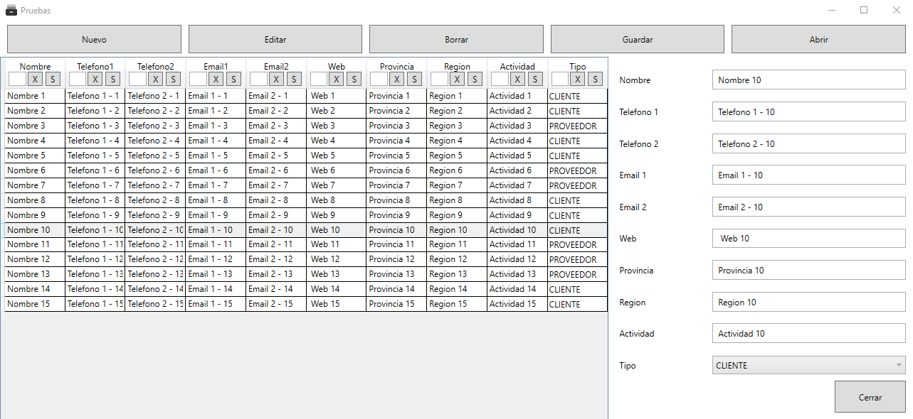
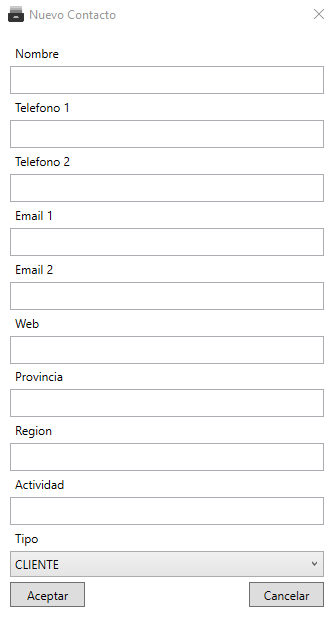

#  Gestor-Proveedores

Gestor básico de información de proveedores y clientes

## Funcionalidad

- Crear un nuevo registro
- Editar un registro
- Borrar un registro
- Exportar a un excel
- Importar desde un excel
- Filtrar los datos
- Ordenar los datos
- Control de cambios no guardados
- Ventana de espera

## Manual 

### Instalacion
**La aplicación únicamente funciona en windows, probado solo en windows 10**

Para instalador, es necesario descargar la aplicación comprimida en **zip**, en la parte de  [releases](https://github.com/LuisPFdez/Gestor-Proveedores/releases/)

Hay dos descargas disponibles
#### App
Código de la aplicación que contiene los archivos necesarios para su funcionamiento, sin embargo necesita del entorno de ejecución de [.NET](https://dotnet.microsoft.com/download/dotnet/5.0).

#### App-Completa
A diferencia de App, no necesita del entorno de ejecución  de .NET, sin embargo es bastante más pesada y contiene bastantes ficheros.

### Funcionamiento
La aplicación se compone de una barra superior con todas las opciones posibles. Y un lista con todos los registros.

Al seleccionar un registro de la lista se abrirá un panel lateral con los datos del registro seleccionado

#### Crear Nuevo Registro

Al seleccionar el botón  nuevo se mostrará una ventana, en la que podras insertar la información. Esta ventana no es redimensionable. Todos los campos pueden quedar vacíos, excepto el nombre (muestra un pequeño mensaje por pantalla) y el Tipo. 

Para crear un contacto pulsa sobre crear. Si seleccionas cancelar no creará el contacto.

#### Editar un registro

El menú lateral muestra la información del registro seleccionado. Para editarlo cambia los parámetros, en los campos del menú, y una vez finalizado selecciona el botón editar. 

Para esconder el menú pincha sobre el botón cerrar de este.

#### Borrar un registro

Para borrar un registro, selecciona un elemento (se abrirá el menú lateral), y pincha sobre el botón borrar.

#### Exportar o Guardar

Para exportar los datos a un excel, selecciona el botón Guardar. 

Se abrirá una ventana, para elegir donde guardar el archivo y cual será el nombre de este.

Al guardar se ejecutará en segundo plano (si contiene un gran número de datos puede tardar unos segundos). Al abrir o cerrar la aplicación, si hay algún proceso de guardado, la aplicación esperará a que estos procesos terminen. 

#### Importar o Abrir 

Para importar los datos de un excel, selecciona el botón Abrir. 

Se abrirá una ventana para seleccionar el archivo del que se importará la información. 

**Si el archivo contiene una gran cantidad de datos puede bloquearse unos segundos, hasta haber cargado todos los datos**

#### Sobre Importar y Exportar
* Las ventanas de cada función solo mostrarán archivos con la extensión *xlsx*. 
* Si algún otro programa, tiene abierto el archivo que vas a abrir o a sobreescribir, se mostrará un mensaje de error. Cierra todos programas que estén trabajando con el archivo para guardar o abrir el archivo. 

#### Filtros
Cada columna tiene una barra de búsqueda y dos botones.

Al buscar se obtendrá los elementos de la columna que contengan de forma completa o parcial la búsqueda. 

Para buscar primero introduce la búsqueda, después selecciona el segundo botón.

Para eliminar una búsqueda selecciona el primer botón

**Con un gran número de datos las búsquedas pueden tardar unos segundos**

